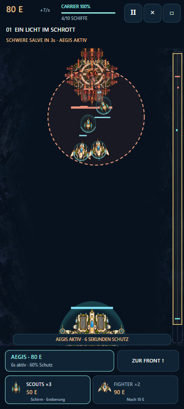
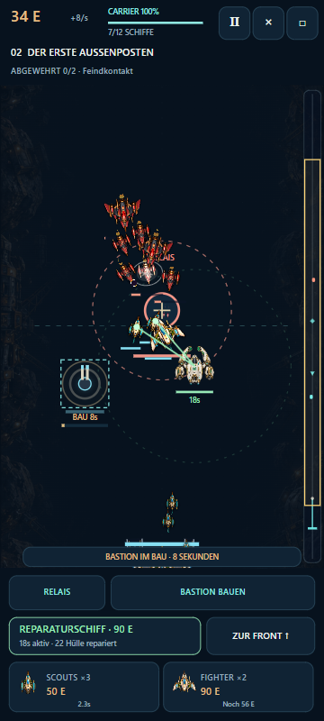
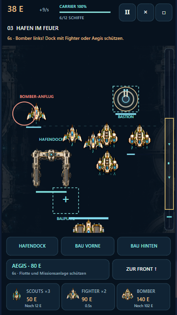

# Kampagnenanfang – Umsetzung und offene Abnahme

Stand: 9. Oktober 2026 · Version **0.0.10-opening-quality** · Grundlage: `main` auf `1b0a46e`. Verbindlicher Umfang: [Qualitätsauftrag](FIRST_THREE_QUALITY_CONTRACT.md). Ausschließlich die ersten drei neuen Missionen wurden überarbeitet. Der weitere Ausbau ist ausgesetzt.

[Spielen](https://emfau88.github.io/strategy-galalaxy/experiments/last-shipyard/) → **Den Hafen zurückerobern / Zum Kampagnenanfang**. Vorhandene Siege bleiben erhalten; die Missionen lassen sich wiederholen. Die alte Sechs-Missionen-Kampagne und die freien Testeinsätze sind nachgeordnet erreichbar. Classic und seine Speicherstände bleiben getrennt.

## Was sich für Spieler ändert

| Einsatz | Konkretes Erlebnis | Eigene Entscheidung |
| --- | --- | --- |
| 1: Ein Licht im Schrott | Kürzerer Wrackkorridor, Scout/Fighter, begrenzter Gegnernachschub und zerstörbarer Blockadeträger. Ab etwa Sekunde 11 kündigt ein Zielkreis eine schwere Salve vier Sekunden vorher an. | Verstärkung kaufen oder 80 Energie für sechs Sekunden Aegis zurückhalten. Die Salve verursacht echten Schaden und wird durch den aktiven Schild reduziert. |
| 2: Der erste Außenposten | Scouts besetzen ein Relais; die Einnahme löst zwei Gegenangriffe aus. Eine Bastion kann für 140 Energie gebaut werden und braucht acht Sekunden. | Energie zwischen neuen Schiffen, ortsfester Verteidigung und der vorab gewählten Unterstützung aufteilen. |
| 3: Hafen im Feuer | Ein angreifbares Dock übersteht drei Angriffe: leichte Überfallgruppe, schwere Eskorte und angekündigte Bomber an der linken Dockflanke. Zwei feste Bauplätze. | Vorne abfangen oder hinten absichern; Bomber gegen schwere Schiffe, Fighter gegen feindliche Bomber; Unterstützung zum passenden Zeitpunkt einsetzen. |

Die eigene Flotte umfasst maximal 10/12/12 Schiffe, die gegnerische maximal 8/10/12. Die ersten drei Missionen erzeugen keine zusätzlichen kostenlosen Drones. Käufe bleiben sofort wirksam. Es gibt keine zusätzliche Währung, keine permanente Zahlenforschung und keinen Grind.

Kaufkarten, Fähigkeit und Frontkamera sind dauerhaft erreichbar. Missionsanlagen und Bauplätze haben eigene Tasten. Größere erkennbare Schiffssilhouetten, kompaktere Carrier und klarere Warnungen ersetzen die bisher überladene Bedienung dieser drei Einsätze. In Ruhephasen erhalten Schiffe getrennte Aufstellplätze; das Dock bleibt dabei frei.

## Unterstützung und Fortschritt

- **Aegis ab M1:** 80 Energie, sechs Sekunden, 60 % Schadensminderung, 28 Sekunden Abklingzeit. Schützt Carrier, eigene Schiffe der Lane und relevante Missionsanlagen; keine gebauten Bastionen.
- **Reparaturschiff ab M2:** vor jedem Einsatz kostenlos alternativ auswählbar. Der Einsatz kostet 90 Energie und einen Flottenplatz. Das unbewaffnete, zerstörbare Schiff begleitet die Flotte für maximal 18 Sekunden und heilt lokal bis zu zwei Schiffe mit je 12 Hülle pro Sekunde. Keine Heilung von Gebäuden, keine eigene Eroberung. 32 Sekunden Abklingzeit.
- M1 öffnet Bastion und Unterstützungswahl; M2 öffnet Bomber; M3 beendet diesen Testabschnitt und setzt den Hafenstatus auf „in Betrieb“. Alle drei Einsätze bleiben wiederholbar. Bereits vorhandene M4-Abschlüsse und alte Ausrüstung gehen nicht verloren.

## Bildprüfung und notwendige Korrektur

Der erste Entwurf verwendete die neuen Hintergrundbilder fast ungedämpft. **Die Nutzerkritik war berechtigt:** Die Architektur und Wrackdetails konkurrierten mit Schiffen, Stationen und Effekten. Meine erste Bildprüfung hatte das nicht ausreichend beanstandet. Dieser Entwurf wurde vor Veröffentlichung korrigiert.

In der korrigierten Kampfansicht erscheint die Kulisse mit nur 18 % Deckkraft und wird zur Mitte zusätzlich vollständig ausgeblendet. Die zentrale Spielfläche ist ruhig und dunkel. Briefings und Missionskarten verwenden die detaillierte Illustration weiterhin. Die Schiffsskalierung wurde etwas zurückgenommen; getrennte Ruhepositionen beseitigen das Zusammenlaufen mehrerer Verbände auf dieselben Haltepunkte.

Ansichten des gebauten Spiels (360 Pixel Breite):

| Schildentscheidung | Reparaturschiff im Gefecht | Dockflanke auf kleinem Bildschirm |
| --- | --- | --- |
|  |  |  |

Die neue Darstellung trennt Hintergrund und Spielobjekte deutlich besser. Das ist eine gestalterische Prüfung durch den Agenten, **keine Zustimmung des Nutzers**. Insbesondere Schriftgröße, Kontrast auf echten Displays, Gefechte mit voller Flotte und die Attraktivität der jetzt ruhigeren Schauplätze brauchen menschliche Rückmeldung.

## Technische Nachweise

- `npm run check`: Classic-Grundlagen und Assetprüfung erfolgreich.
- `npm run check:werft`: Isolation, gespeicherte Fortschritte, alte Missionen und neue Mechaniken erfolgreich. 56 registrierte Bilddateien mit geprüften Hashes. Keine Änderung an Classic-Runtime oder Classic-Assets.
- `npm run build:pages` und `npm run test:site`: beide Einstiegspfade, unveränderte Classic-Ausgabe und getrennte Experimentdateien erfolgreich.
- `node experiments/last-shipyard/scripts/browser-smoke.mjs --site --quality`: durchgehender Weg durch M1–M3 über echte Menüs und Touch-Käufe, Siege ohne gesetzte Erfolgsflags, danach gespeicherte Freischaltungen und Unterstützungswahl nach Neuladen. Reale Schildminderung und Heilung, Bau, Pause, Ergebnisnavigation und Flankenwarnung geprüft. Keine Browser-/Ladefehler. Zusätzliche Ansichten bei 360 × 640 und 390 × 844.
- `--site --pilots`: erhaltene Testzugänge geprüft; Außenpostensieg, Bastionbau und Pause sowie Fährenladung, Stationsverlust und Neustart. Kein neuer Ausbau der Fährenmission.
- Gezielte neue Regelprüfungen: Reparaturkosten, Kapazitätsgrenze, tatsächlich gegnerisch anvisierbares Unterstützungsschiff, begrenzte Heilung, Ablauf/Tod/Pause, Salve mit und ohne Aegis; getrennte tatsächliche Ruhepositionen einer vollen Flotte ohne Docküberlagerung.

Die Browserabläufe beschleunigen die Simulation und lassen Darstellungseffekte entsprechend altern. Sie sind Funktions- und Bildnachweise, keine aufgezeichneten menschlichen Spieltests. Einzelne legale Kaufabläufe gewinnen; daraus folgt weder optimale Balance noch guter Wiederspielwert. Der Hafen wird im abschließenden lokalen Browserablauf tatsächlich beschädigt (rund 752 von 900 Hülle verbleiben), seine Bedrohung ist kein reiner Briefingtext.

## Veröffentlichung und nächster Entscheidungspunkt

Arbeitszweig: `codex/first-three-quality`; Integration per geprüftem Pull Request und grünem CI-Stand. Der zentrale Pages-Workflow veröffentlicht `main`. [Öffentliche Versionsdatei](https://emfau88.github.io/strategy-galalaxy/experiments/last-shipyard/version.json) enthält Version und den veröffentlichten Build-Commit. Der Browserablauf lässt sich mit `--live --quality` auch gegen diesen Stand ausführen.

Es folgt **kein weiterer Missionsbulk**, bevor das neue Spielerlebnis beurteilt ist. Zu klären bleibt: Erkennt ein neuer Spieler die Salve? Ist die Fähigkeit ihre Energie wert? Wird der Unterschied zwischen Außenposten und Hafen erlebt? Ist die Darstellung jetzt angenehm lesbar? Erst diese Antworten bestimmen die nächste Überarbeitung.

## Neue Bilder

Zwei unverändert übernommene Bilder wurden mit dem eingebauten Imagegen erzeugt: `opening-worlds-v1.png` (drei Kulissen in einem Atlas) und `repair-support-v1.png` (transparentes Unterstützungsschiff). Keine nachträgliche Rasterbearbeitung. Zuschnitt, Abdunklung und Effekte entstehen im Renderer. [Dateien, genaue finale Prompts und SHA-256](../experiments/last-shipyard/provenance/generated-assets.json) · [Assetbeschreibung](../experiments/last-shipyard/provenance/GENERATED_ASSETS.md).
