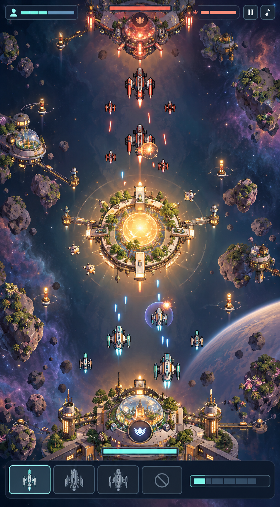

# Level 1 – Orbital Garden

Status: Umsetzung läuft; Map, Runtime-Art, Ein-Lane-Regeln und Levelauswahl sind integriert, Browserabnahme steht aus.



## Ziel

Level 1 führt den Kern in einer einzigen breiten Lane ein. Die bestehende Tall-world-
Karte mit zwei unabhängigen Lanes wird zu Level 2. Das erste Level soll leichter lesbar,
wärmer und persönlicher wirken, ohne den automatischen Flottenkampf zu vereinfachen.

## Kartenaufbau

```text
Rival HQ + ein Turret
        │
breiter oberer Anflug
        │
Orbital Garden / Sunwell Node
   Lane weitet sich zum Ring
        │
breiter unterer Anflug
        │
Player HQ + ein Turret
```

- Eine Lane nutzt ungefähr 300–340 der 420 Weltpixel und bietet Großschiffen Platz für Breitseiten.
- Der große zentrale Node ist ein sichtbarer Energiehafen, kein kleines abstraktes Symbol.
- Am Node weitet sich die Route; Formationen kämpfen um den Ring, ohne die Lane zu wechseln.
- Asteroidengärten, Gewächshauskuppeln, Navigationsbojen und Wartungsdrones liegen außerhalb des Kampfkorridors.
- Warmes Licht markiert sichere Infrastruktur; Coral und Cyan bleiben Teamhinweise statt dominanter Neonflächen.

## Level-1-Regeln

- Eine Queue und zunächst drei gekaufte Verstärkungsslots pro Deployment.
- Zwei automatische Drones pro Welle halten die Front aktiv, ohne das Bild zu überfüllen.
- Ein Energy Node vermittelt Capture, Einkommen und den Wert von Scouts unmittelbar.
- Pro Seite schützt ein Turret den inneren HQ-Anflug.
- Scout, Fighter und Frigate werden zuerst eingeführt; Bomber und Forschung können nach dem ersten Turretverlust oder einem kurzen Tutorial-Schritt freigeschaltet werden.
- Das vertikale Panning bleibt erhalten, benötigt wegen der einfacheren Front aber weniger Aufmerksamkeit.

## Übergang zu Level 2

Level 2 übernimmt die aktuelle Zwei-Lane-Karte und erweitert das Gelernte:

- zwei unabhängige Fronten statt einer;
- vier gemeinsame Slots und echte Verteilungskonkurrenz;
- zwei Nodes, zwei Turrets pro Seite und vollständige Upgrade-Auswahl;
- höherer Informationsdruck, Offscreen-Kampfsignale und komplexere Formationen.

Damit ist Level 2 nicht nur optisch eine andere Karte, sondern eine verständliche
strategische Eskalation: erst Komposition und Timing lernen, dann Aufmerksamkeit und
Ressourcen zwischen zwei Lanes aufteilen.

## Produktionshinweis

Das Mockup ist eine Art-Direction-Referenz, kein fertiges Runtime-Asset. Die vorhandenen
Schiffs- und HQ-Assets bleiben maßgeblich. Für die Umsetzung sollten Sunwell, Garteninseln,
Bojen und Randdekorationen als getrennte Layer erstellt werden, damit Kampfgeometrie,
Animation und Mobile-Performance unabhängig bleiben.

## Bildherkunft

Erstellt mit der eingebauten Bildgenerierung als High-Fidelity-UI-Mockup. Der aktuelle
420×760-Kampf-Screenshot diente als Referenz für Perspektive und Produktidentität; Layout,
Mapstruktur, Lichtstimmung und Umgebungsdesign wurden für das neue Ein-Lane-Level neu entworfen.
