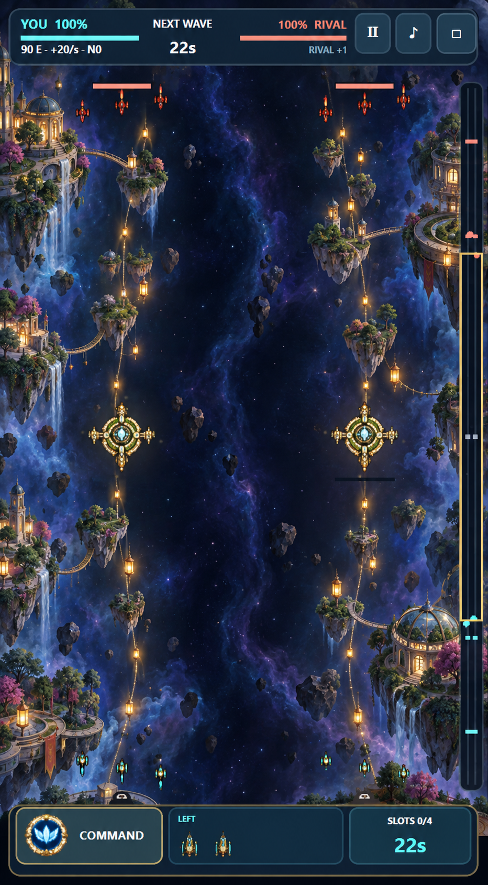
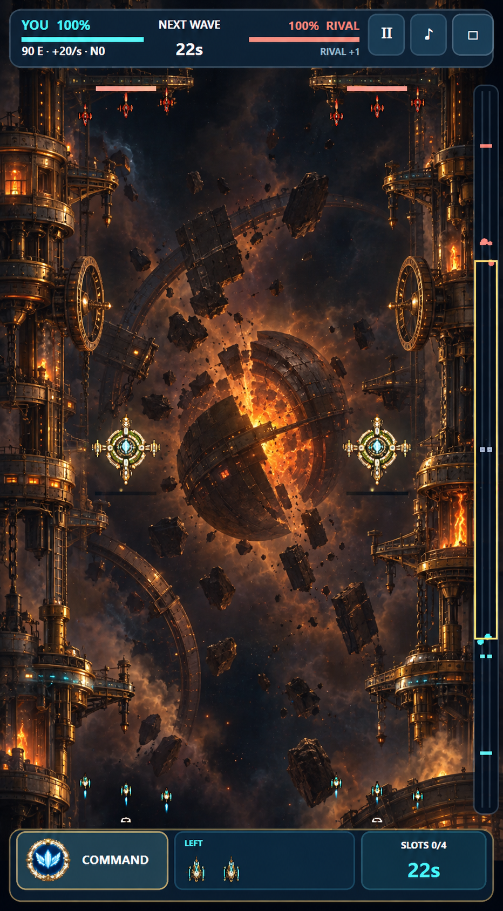
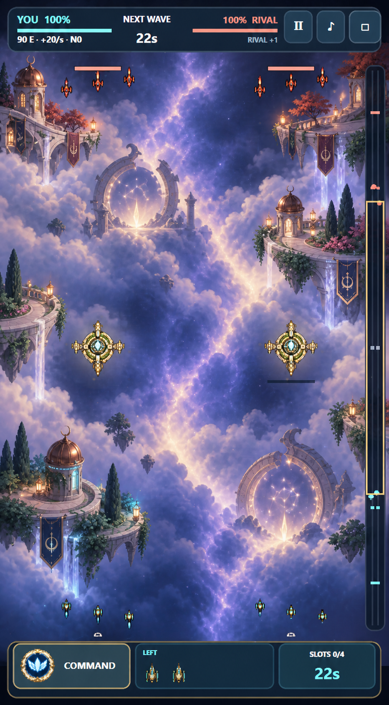
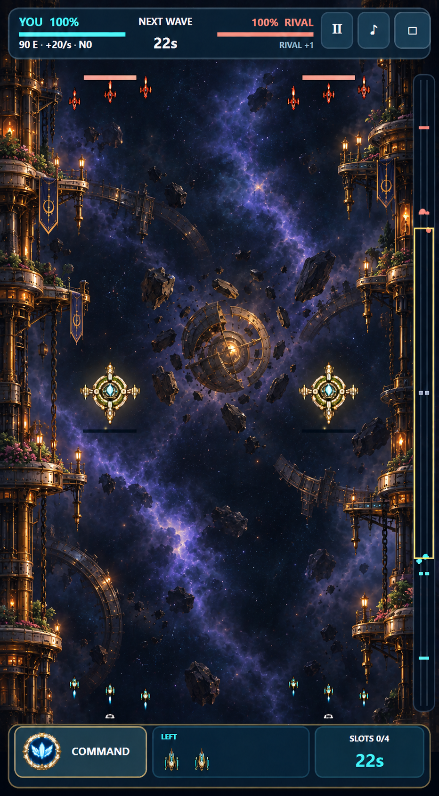

# Level 2 – Visual Directions

This document compares three deliberately different visual directions for Level 2,
`Twin Fronts`. The mockups are target images for world composition and atmosphere;
they are not drop-in runtime screenshots. The existing two-lane geometry, tall camera,
HUD, ships, structures and simulation remain authoritative.

## Shared gameplay contract

Every direction must preserve these requirements:

- Two immediately distinguishable vertical combat lanes.
- A quieter central divide that prevents both fronts from merging visually.
- Open contrast pockets around the primary firing lines.
- Three readable world regions while scrolling: rival sector, contested center and
  player sector.
- Edge-weighted scenery so projectiles and small ships remain visible.
- Player cyan, rival coral and neutral warm-gold accents.
- Strictly separate environment, structure and gameplay layers. Ships, projectiles,
  turrets, HQs and capture feedback are never baked into the map.
- The same `420 × 1180` world and mobile camera behavior as the existing level.

## Direction A – Lantern Trade Routes

Two inhabited trade routes cross an orbital garden archipelago. Small cultivated
islands, lantern chains, bridges and botanical station fragments guide each lane,
while a dark blue-violet rift keeps the fronts separate.

### Strengths

- Best continuation of Level 1's ivory, brass, vegetation and warm-light identity.
- The lantern chains make both lanes legible without drawing hard lane lines.
- Cozy and inhabited, but still leaves useful dark space around combat.
- Reuses the project's established material language and therefore needs fewer new
  structure families.
- Naturally supports small animated details such as beacon flicker, drifting leaves,
  maintenance craft and warm windows.

### Risks

- Could feel too similar to Orbital Garden if its island silhouettes and landmark
  language are not made more linear and commercial.
- Too many lanterns or bridges would compete with projectiles.
- Side architecture must remain outside the actual collision and firing corridors.

### Runtime interpretation

- Use two complementary tall background sectors with scenery concentrated at the
  outer edges and beside the central divide.
- Build route beacons as a sparse overlay so their intensity can be tuned separately.
- Give the neutral center one trade-gate landmark per lane rather than a single giant
  object spanning both lanes.

## Direction B – Twin Foundries

The fronts run through two fortified orbital foundries on opposite sides of a broken
ancient solar forge. Copper machinery, cargo rails and furnace windows create a more
martial environment; the fractured core supplies a strong center landmark.

### Strengths

- Most distinct from Level 1 and gives the second map a clear escalation in tone.
- Strong landmark hierarchy and an immediately memorable central event.
- Excellent thematic home for visible Arsenal, Bastion and industrial upgrades.
- Warm furnaces prevent the industrial setting from becoming generic cold science
  fiction.

### Risks

- The mockup is currently too dense and too orange for final gameplay.
- Bright fire and debris can overpower team projectiles and damage feedback.
- Large machinery near the lane centers could imply obstacles that do not exist.
- Least cozy direction and therefore the greatest tonal departure from the title
  screen and Level 1.

### Runtime interpretation

- Reduce the core to a dim background landmark and keep its brightest area behind the
  central divide, not behind either firing line.
- Use restrained edge foundries, mechanical route markers and sparse debris rather
  than the mockup's full wall of machinery.
- Reserve animated furnace intensity for short world pulses or upgrade activation.

## Direction C – Cloudsea Sanctuaries

Two sanctuary routes float above a luminous violet-blue cloud ocean. Pale terraces,
copper observatories, gardens, pennants and ancient constellation gates create a
dreamlike science-fantasy world.

### Strengths

- Coziest and most emotionally distinctive proposal.
- Extends the game's garden identity into a softer, almost celestial region.
- Pale stone and copper architecture create attractive landmark silhouettes.
- Faction-colored foliage and lanterns can communicate territorial progression.

### Risks

- The bright cloud field significantly lowers contrast for ivory ships and cyan fire.
- It drifts furthest from the current deep-space battlefield language.
- Gates and terraces can visually imply curved routes despite straight simulation
  lanes.
- Requires the most disciplined darkening and masking around active combat zones.

### Runtime interpretation

- Darken both actual firing corridors by roughly one exposure step and keep luminous
  clouds mainly in the central divide and outside edges.
- Use constellation gates as off-lane landmarks, never as apparent obstacles.
- Treat clouds as slow parallax or masked overlays, with minimal movement near units.

## Selected production direction

After comparing the three concepts in-game, the selected direction is a restrained
**Twin Foundries / Cloud Rift hybrid**. Twin Foundries supplies the identity and edge
architecture; Cloudsea contributes only the depth and violet-blue central atmosphere.
The final target deliberately avoids the original foundry mockup's full orange density
and the Cloudsea mockup's bright fantasy landscape.

The runtime interpretation keeps roughly 55–60% of the world as open navy/black combat
space, confines charcoal/copper and ivory/brass foundry structures to the outer edges,
and uses a narrow low-contrast cloud rift to separate the two lanes. Small gardens and
warm practical lamps retain the cozy handcrafted identity established by Level 1.

The background sectors are now integrated. Remaining work is limited to real-device
contrast/seam tuning, restrained parallax and final structure variants; those items are
tracked in `PRODUCT_POLISH_ROADMAP.md`.

## Production acceptance criteria

- At 360 pixels wide, both lanes are identifiable within two seconds without the HUD.
- Player and rival Scout silhouettes remain readable over every map region.
- Cyan and coral projectiles retain visible bodies and trails at native gameplay scale.
- No high-contrast background landmark sits directly behind a turret, HQ health bar or
  normal engagement band.
- The top, middle and bottom camera positions each contain one recognizable landmark.
- Level 2 feels related to Level 1 without looking like a mirrored or recolored copy.
